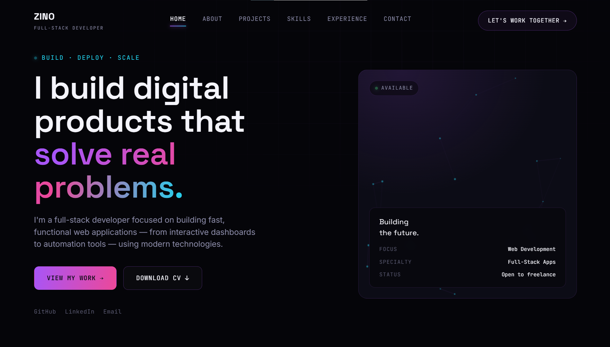
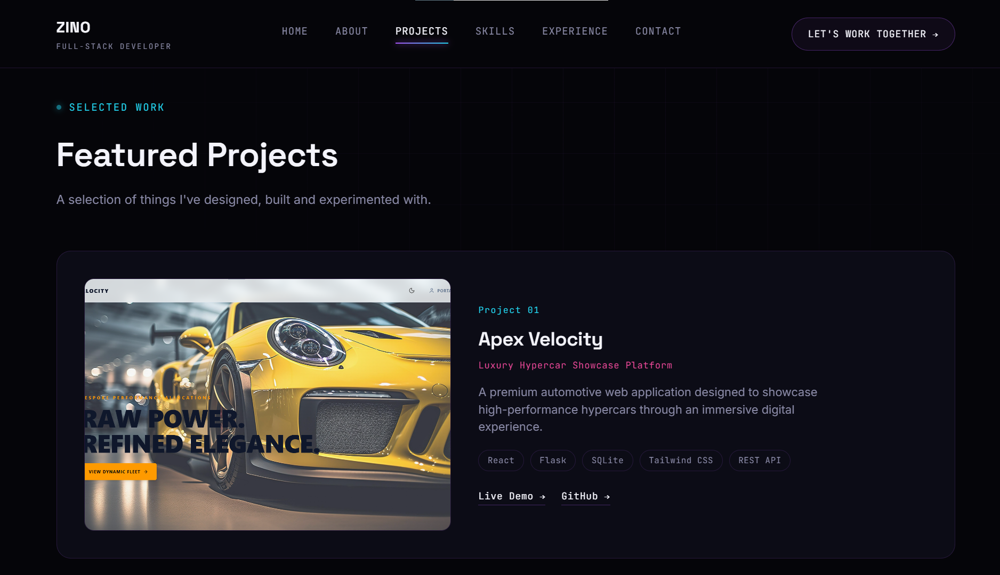
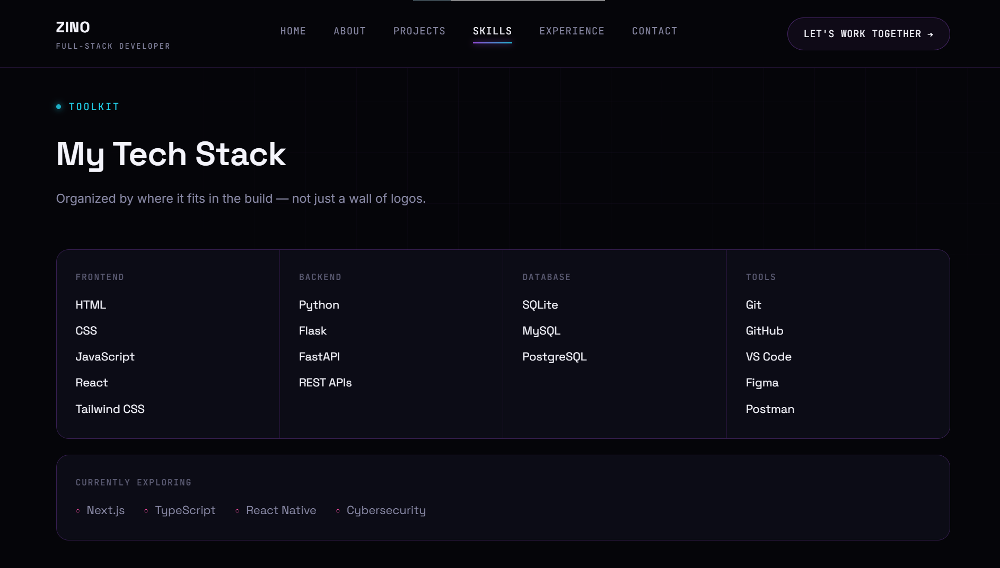
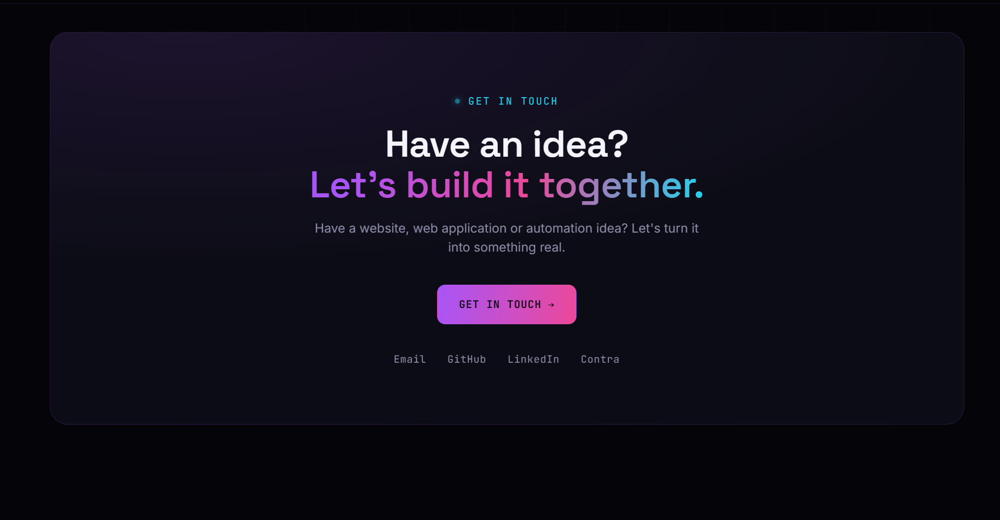

# Zino — Portfolio

A personal portfolio site for Zino, a full-stack developer. Built as a static site — no framework, no build step.

## Live site

[\[Add your live Vercel URL here once deployed\]](https://zinodev.vercel.app/)

## Preview

**Hero**


**Featured Projects**


**Tech Stack**


**Contact**


## Tech

- HTML5
- CSS3 (custom properties, grid, flexbox, `backdrop-filter`)
- Vanilla JavaScript (`IntersectionObserver`, Canvas API for the hero particle animation)
- Fonts: Space Grotesk, Inter, JetBrains Mono (Google Fonts)

## Structure

```
.
├── index.html      # Page content and structure
├── style.css       # All styling
├── script.js       # Scroll effects, mobile menu, particle animation
└── (images/PDFs)   # Project screenshots, logo, favicon, CV
```

## Sections

- Hero — intro, CTA buttons, live status panel
- Featured Projects — Apex Velocity, QuizDash, CryptoPulse
- About
- Tech Stack
- What I Build (services)
- Automation
- How I Build (process)
- Development Journey
- Contact

## Running locally

No build step needed — just open `index.html` in a browser, or serve the folder with any static server, e.g.:

```bash
python3 -m http.server 8000
```

Then visit `http://localhost:8000`.

## Deployment

Deployed on [Vercel](https://vercel.com) as a static site.

## Contact

- Email: "jedidiah.eloho@gmail.com"
- GitHub: "https://github.com/Eloho-Elozino"
- LinkedIn: "www.linkedin.com/in/elozino-eloho-6784743a1"

